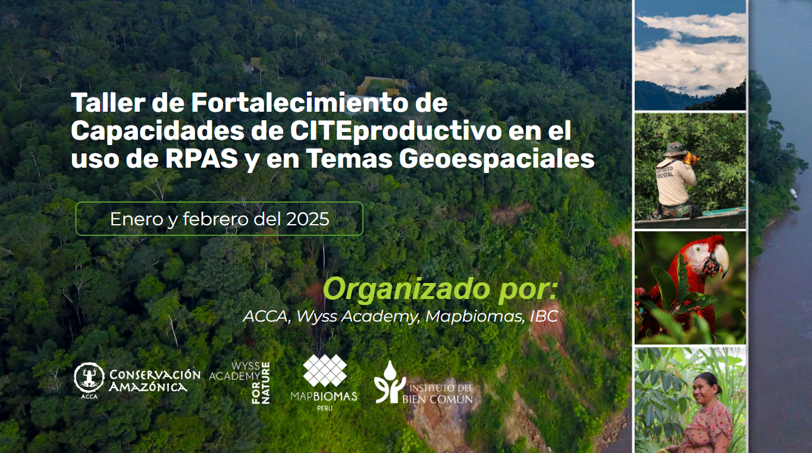

# Taller de Fortalecimiento de Capacidades de CITEproductivo en el uso de RPAS y en Temas Geoespaciales
Este entrenamiento surge en base a un acuerdo de cooperación entre Wyss Academy y el CITEproductivo, el cual tiene como objetivo mejorar las capacidades del equipo técnico destacado del laboratorio de geomática del CITEproductivo. Por otra parte, Conservación Amazónica - ACCA, al ser el soporte técnico en temas de acceso, manejo de información y análisis espacial de Wyss Academy, es el encargado del presente entrenamiento, con soporte de IBC y Mapbiomas.
Al final del taller, los participantes serán capaces de:
1. Tener nociones básicas sobre el uso de RPAS, para el análisis temporal y detección de cambios para la evaluación de la dinámica de las zonas de interés en Madre de Dios;
2. Utilizar plataformas de libre acceso como Google Earth Engine para el procesamiento de imágenes satelitales mediante programación;
3. Plantear un correcto flujo de trabajo para la detección y cuantificación de pérdidas de bosque;

El material de cada taller realizado se puede encontrar en las pestañas en el panel lateral izquierdo. Adicionalmente, se puede encontrar información sobre los organizadores en la pestaña de **Organizadores**, material suplementario bajo la pestaña de **Recursos** y fotos de los talleres en la pestaña de **Fotos**.

## Agenda
La siguiente tabla muestra el temario elaborado para el presente taller.

| N°              | Tema                                                                         | Día                 | Formato    |
|:----------------|:-----------------------------------------------------------------------------|:--------------------|:-----------|
| 1               | Introducción al uso de drones                                                | Enero 27 2025       | Presencial |
| 2               | Planificación de vuelos                                                      | Enero 27 2025       | Presencial |
| 3               | Procesamiento de imágenes                                                    | Enero 28 2025       | Presencial |
| 4               | Imágenes multiespectrales y datos LiDAR                                      | Enero 28 2025       | Presencial |
| 5               | Análisis de datos                                                            | Enero 29 2025       | Presencial |
| 6               | Conceptos preliminares                                                       | Febrero 10 2025     | Presencial |
| 7               | Introducción a Google Earth Engine                                           | Febrero 10 2025     | Presencial |
| 8               | Técnicas de monitoreo                                                        | Febrero 11 2025     | Presencial |
| 9               | Introducción al Machine Learning                                             | Febrero 11 2025     | Presencial |
| 10              | Métricas de rendimiento y exactitud de mapas                                 | Febrero 12 2025     | Presencial |
| 11              | Mapbiomas Perú                                                               | Febrero 12 2025     | Presencial |
| 12              | Productos complementarios                                                    | Febrero 13 2025     | Presencial |
| 13              | Series de tiempo                                                             | Febrero 14 2025     | Presencial |
| 13              | Integración entre QGIS y GEE                                                 | Febrero 14 2025     | Presencial |

## Sugerencias
Si tiene algunas sugerencias sobre el taller, por favor rellene el formulario abajo. ¡Nos ayuda mucho para mejorar en los siguientes talleres!

[Denos sus sugerencias](https://forms.gle/gSGWxatR84Z5w6HN6){: .btn .btn-purple }